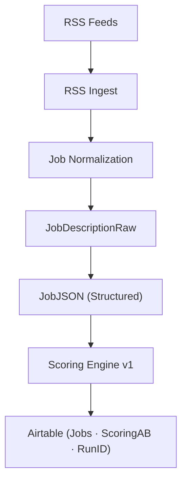

# Job Agent MVP — AI Job Intelligence & Scoring Engine

**Job Agent MVP** is a production-grade AI pipeline that automates job discovery, parsing, and candidate job fit scoring using an explainable, audit ready scoring framework.

This system is designed for **signal over volume**. Prioritizing decision quality, traceability, and controlled experimentation.


---

## Why This Exists

Most job platforms optimize for **volume**, not **fit**.

Candidates waste time applying to low signal roles, while recruiters receive misaligned applications.

**Job Agent MVP** exists to:

- Reduce noise  
- Surface high signal opportunities  
- Help candidates focus effort where it actually matters  

Think of it as:

> **Human recruiter judgment × AI speed × full auditability**

---

## Who This Is For

This system is designed for:

- Applied AI / ML engineers  
- Forward deployed & solutions engineers  
- Technical professionals targeting high signal roles  
- Builders who want **explainable AI**, not black box recommendations  

---

## Key Capabilities

### End-to-End Pipeline

- Live RSS job feed ingestion (configurable)
- Job normalization and cleaning
- Structured **JobJSON** generation
- Candidate aware scoring
- Airtable persistence for workflow, analysis, and experiments

---

### Proprietary Scoring Engine

The scoring engine blends deterministic logic with creative alignment:

**Hard gates**
- Security clearance requirements
- Travel expectations
- Role family constraints
- Non negotiable exclusions

**Soft alignment scoring**
- Transferable skills
- Adjacent experience
- Learning velocity
- Role evolution potential

Each job is deterministically mapped to a next action:

- **Apply Now**
- **Apply**
- **Network First**
- **Skip**

No black boxes. Every decision is justified.

---

### Explainability & Trust

Every scored job includes:

- Fit rationale
- Gaps and risks
- Resume tailoring keywords
- Verification questions
- Confidence score
- Evidence references (job + candidate context)

All outputs are **auditable and explainable**.

---

### A/B Prompt Testing Infrastructure

The system supports A/B scoring experiments:

- Multiple scoring engines can run concurrently
- Results are persisted in a single **ScoringAB** field
- Outcomes can be compared empirically per job
- Winning prompts are selected based on evidence, not intuition

---

### RunID Traceability

Every execution generates a unique **RunID**, written alongside results.

This enables:

- Experiment tracking
- Auditability
- Regression analysis
- Rollbacks and comparisons across runs

---

## Design Principles

This system is intentionally built as an **operational pipeline**, not a prototype:

- Idempotent ingestion and scoring (safe re-runs)
- Defensive JSON validation for all LLM outputs
- Prompt hashing for integrity and regression tracking
- Explicit hard gates to prevent unsafe recommendations
- Deterministic decision mapping
- Clear separation between ingestion, normalization, scoring, and persistence

---

## High-Level Architecture





## Project Structure

```text
job-agent-mvp/
├── src/
│   ├── rss_ingest.py
│   ├── rss_normalize_ingest.py
│   ├── score_new_jobs.py
│   └── ...
├── prompts/
│   └── job_scorer_v1.txt
├── .env.example
├── README.md
└── requirements.txt
```

## Configuration

### Environment Variables

Create a `.env` file using `.env.example` as a reference:

```env
OPENAI_API_KEY=your_key_here
AIRTABLE_API_KEY=your_key_here
AIRTABLE_BASE_ID=your_base_id
AIRTABLE_TABLE_JOBS=Jobs
RSS_FEED_URLS=url1,url2
```
## Usage

### 1️⃣ Ingest Jobs

```bash
python src/rss_ingest.py
```

### 2️⃣ Score Jobs

```bash
python src/score_new_jobs.py --max 10
```

### 3️⃣ A/B Test Scoring Engines

```bash
python src/score_new_jobs.py --ab-test v1 --max 5
```

### 4️⃣ Diagnostics

```bash
python src/score_new_jobs.py --diag
python src/score_new_jobs.py --print-prompt-hash
```

## Scoring Philosophy

Job matching is not a pure science.

This system intentionally blends:

- Deterministic logic (hard constraints)
- Creative reasoning (adjacency, growth, potential)
- Explainability (every decision justified)

The goal is not perfect prediction —  
the goal is better decision focus.

---

## Security & Safety

- No hardcoded secrets
- `.env` fully ignored
- `.env.example` uses placeholders only
- Prompt hashes logged for integrity
- Defensive schema validation on all AI outputs

---

## Non-Goals

This system is intentionally not:

- A mass application or resume spam bot
- A black box recommendation engine
- A replacement for human judgment or networking

It is a decision support system, not an autopilot.

---

## Roadmap (Selected)

- Candidate profile optimization & simulations
- Scoring calibration analytics
- Job cluster analysis
- Outreach automation
- Multi candidate support
- Resume auto tailoring

---

## License

MIT License

